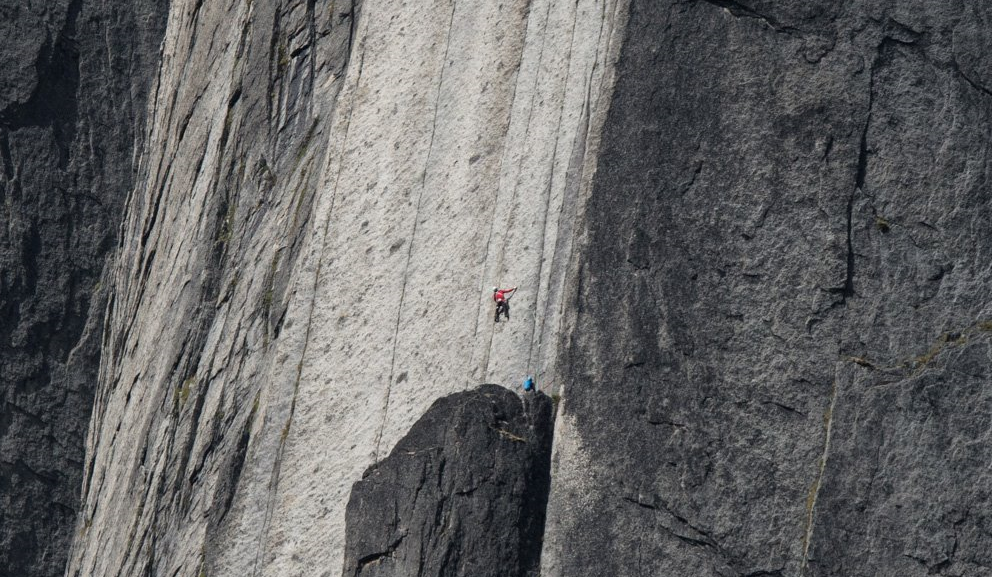

# Image(이미지)

## 이미지 삽입

`` 을 이용하여 이미지를 삽입한다.

``은 종료 태그가 없는 empty tag(빈 태그)이다.

+ **문법**
    + ``
    + src : 이미지가 저장된 주소 URL
    + alt : 이미지가 로딩되지 않을 시 대신해서 나올 문자열  


```html

```


## 이미지 크기 설정

+ **방법들**
    1. style attribute 을 사용하여 이미지 크기 변경
    2. width 와 height attribute 을 사용하여 이미지 크기 변경
    3. CSS를 이용하여 내외부 스타일 시트 상관없이 모든 이미지 크기 변경

기본적으로 이미지 픽셀단위로 바꾼다.

+ ### Style attribute을 이용한 이미지 크기 변경

```html

```


+ ### width 와 height attribute 을 사용하여 이미지 크기 변경

```html

```

+ ### CSS를 이용하여 내외부 스타일 시트 상관없이 모든 이미지 크기 변경

```html
<style>
    img {
        width: 320px;
        height: 320px;
    }
</style>
```


## 이미지 테두리 설정

border attribute를 이용하여 테두리 사용여부와 굵기를 설정한다.
방법은 CSS와 style이 있다.

```html

```


## 이미지 링크 만들기(하이퍼링크)

`<a>` 를 사용하면 된다.

```html
<a href="Background(배경색).html">
    
</a>
```

## 이미지 맵 만들기

이미지 맵이란 이미지 일부를 버튼처럼 만들어 클릭할 수 있게 만드는 기능이다.

``의 usemap attribute와 `<map>`의 name attribute 으로 만들 수 있다.

+ `<map>`
    + 하나 이상의 영역을 가지고 있으며 `<area>` 태그를 이용하여 영역을 나눈다.


+ `area`
    + shape 은 어떤 모양의 공간을 놓을지 정하는 attribute다
        + rect(사각형), circle(원) 등이 있다.
    + coords 은 shape에 따른 좌표를 넣는 attribute다.
    + alt 은 이미지가 안나올때 나오는 글
    + href 은 URL

```html

<map name="use">
    <area shape="rect" coords="0,0,320,160" alt="위" href="Background(배경색).html">
    <area shape="rect" coords="0,160,320,320" alt="위" href="Link(링크).html">
</map>
```

이미지의 (0,0)과 (320,160)을 가지고 사각형을 영역을 만들어 Background(배경색).html이 나오도록 하였다.

이미지의 (0,160)과 (320,320)을 가지고 사각형을 영역을 만들어 Link(링크).html이 나오도록 하였다.


참조 : http://www.tcpschool.com/html/html_basic_images
